<h1 align="center">Wassup! </img></h1>

👨‍🎓 ITMO University 2nd year student.

👨‍💻 Junior Developer (C# + TS)

👨‍🏫 Currently working on:
   - Dotnet in general (`Roslyn`, `Performance`, `GC`)
   - Backend (`ASP.NET Core`, `IIS`)
   - Databases (`T-SQL`)
   - Unit-testing (`NUnit`/`xUnit` + `AutoFixture` + `Moq`)

### My social networks:

[](https://www.linkedin.com/in/mikhail-libchenko-9b820522a/)
[](https://t.me/dirty_lipa)
[](https://www.instagram.com/dirty_lipa/)
[](https://open.spotify.com/user/213fpft2wghl5ywvgb8lpz0xp?si=a635583a007043bd)

# My statistics


[](https://wakatime.com/@2ab39d17-44a5-4823-8a27-97945eee1ce4)

## Current activity

<!--START_SECTION:waka-->

```text
From: 16 July 2022 - To: 23 July 2022

Total Time: 41 hrs 18 mins

C#                        18 hrs 41 mins  ⣿⣿⣿⣿⣿⣿⣿⣿⣿⣿⣿⣤⣀⣀⣀⣀⣀⣀⣀⣀⣀⣀⣀⣀⣀   45.24 %
TypeScript                6 hrs 10 mins   ⣿⣿⣿⣶⣀⣀⣀⣀⣀⣀⣀⣀⣀⣀⣀⣀⣀⣀⣀⣀⣀⣀⣀⣀⣀   14.95 %
HTML                      5 hrs 52 mins   ⣿⣿⣿⣦⣀⣀⣀⣀⣀⣀⣀⣀⣀⣀⣀⣀⣀⣀⣀⣀⣀⣀⣀⣀⣀   14.21 %
JSON                      5 hrs 30 mins   ⣿⣿⣿⣤⣀⣀⣀⣀⣀⣀⣀⣀⣀⣀⣀⣀⣀⣀⣀⣀⣀⣀⣀⣀⣀   13.35 %
SCSS                      2 hrs 6 mins    ⣿⣤⣀⣀⣀⣀⣀⣀⣀⣀⣀⣀⣀⣀⣀⣀⣀⣀⣀⣀⣀⣀⣀⣀⣀   05.10 %
textmate                  41 mins         ⣦⣀⣀⣀⣀⣀⣀⣀⣀⣀⣀⣀⣀⣀⣀⣀⣀⣀⣀⣀⣀⣀⣀⣀⣀   01.67 %
```

<!--END_SECTION:waka-->

## Global activity

<div display="block">
	
	
	
</div>

<br/>
<br/>
<br/>

# My skills

### `Langs`


### `Frameworks`


### `Data Bases` / `Cache`


### `Tools and other`


