### <h1 align="center">Wassup! </img></h1>

<!-- <div align="center">
	
</div> -->

#### 👨‍🎓 Studying at ITMO University, 2 course.

#### 👨‍💻 I’m currently learning:
   - OOP (`C#`)
   - Backend (`ASP.NET Core`/`Entity Framework`)

#### My social networks:

<a href="https://www.instagram.com/dirty_lipa/">
   
</a>
<a href="https://t.me/dirty_lipa">
   
</a>
<a href="https://open.spotify.com/user/213fpft2wghl5ywvgb8lpz0xp?si=a635583a007043bd">
   
</a>

## My statistics

<a href="#" target="_blank">
   
</a>
<a href="#" target="_blank">
   
</a>
<a href="#" target="_blank">
   
</a>

<a href="https://wakatime.com/@2ab39d17-44a5-4823-8a27-97945eee1ce4">
	
</a>

### Current activity

<!--START_SECTION:waka-->
```text
From: 17 February, 2022 - To: 24 February, 2022

C#         23 hrs 22 mins  ██████████████▒░░░░░░░░░░   57.58 % 
Java       5 hrs 10 mins   ███▒░░░░░░░░░░░░░░░░░░░░░   12.76 % 
Markdown   4 hrs 34 mins   ██▓░░░░░░░░░░░░░░░░░░░░░░   11.27 % 
Scala      2 hrs 11 mins   █▒░░░░░░░░░░░░░░░░░░░░░░░   05.41 % 
C++        1 hr 21 mins    █░░░░░░░░░░░░░░░░░░░░░░░░   03.34 % 
```
<!--END_SECTION:waka-->

### Global activity

<div display="block">
	
	
	
</div>

<br/>
<br/>

## Languages and Tools

### Base


### Additional

#### `Data Bases`


#### `Langs`


#### `Tools`


